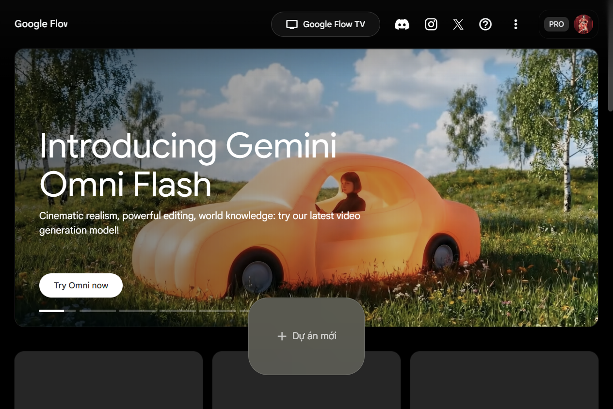

# 🎬 NAV TOOLS — Desktop AI Video/Image Generator

<p align="center">
  
</p>

**NAV Tools** là một ứng dụng desktop mạnh mẽ giúp tự động hóa quy trình tạo video và hình ảnh bằng trí tuệ nhân tạo (AI) sử dụng các nền tảng tiên tiến hàng đầu hiện nay như **Google Labs (Flow - Video-FX, Image-FX)** và **X.com Grok AI**. Ứng dụng được xây dựng trên nền tảng Python, giao diện đồ họa hiện đại với **PySide6** và lõi tự động hóa trình duyệt **Playwright**.

---

## 🌟 Các tính năng nổi bật

### 1. Tạo Ảnh & Video bằng Google Flow (Video-FX / Image-FX)
* **Tạo hình ảnh (Image-FX)**:
  * Hỗ trợ model thế hệ mới nhất (**Nano Banana 2**).
  * Cho phép **tạo hàng loạt (Batch Generation)** với số lượng ảnh tùy chọn cực nhanh.
  * Tự động điều hướng và gọi API ngầm từ trình duyệt để lấy dữ liệu ảnh sạch, bỏ qua các bước thủ công.
* **Tạo video (Video-FX)**:
  * Hỗ trợ model cao cấp nhất (**Veo 3.1 - Fast**).
  * Hỗ trợ các tỷ lệ khung hình chuẩn (16:9, 9:16, 1:1, v.v.).
  * Tự động hóa hoàn toàn các thao tác giao diện: điền prompt, chọn cài đặt, bấm tạo, theo dõi tiến trình và tự động tải video về máy.

### 2. Tạo Ảnh & Video bằng Grok AI (X.com)
* Tích hợp tài khoản Grok để tạo ảnh và video chất lượng cao trực tiếp trên tài khoản X Premium của bạn.
* Hỗ trợ các chế độ Grok Image (Tốc độ / Chất lượng) và Grok Video.

### 3. Quản lý Tài khoản Thông minh (Multi-Account & Auto-Rotation)
* Quản lý cùng lúc danh sách nhiều tài khoản Google và Grok.
* **Tự động đăng nhập và đồng bộ cookie/session**: Trình duyệt Chrome ẩn kết nối qua giao thức gỡ lỗi CDP giúp lưu giữ phiên đăng nhập an toàn, không bị Google quét bot.
* **Gia hạn phiên tự động**: Tự làm mới Session Token khi hết hạn mà không cần người dùng can thiệp.
* **Xoay vòng tài khoản tự động (Auto-Rotation)**: Khi tài khoản hiện tại hết lượt tạo (hết quota) hoặc bị lỗi, phần mềm sẽ tự động chuyển sang tài khoản tiếp theo trong danh sách để chạy tiếp tác vụ, tránh bị gián đoạn.

### 4. Công cụ Nâng cao
* **Upscale chất lượng**: Nâng cao độ phân giải hình ảnh lên 2K/4K và video lên 1080p/2K.
* **Ghép nối video (Flow Concat)**: Tự động ghép nối nhiều video ngắn đã được tạo thành một video dài hoàn chỉnh.

---

## 📸 Giao diện ứng dụng

### Trang quản lý tác vụ Google Flow


---

## 🛠️ Yêu cầu hệ thống

* **Hệ điều hành**: Windows 10 / 11 (64-bit).
* **Python**: Phiên bản 3.10 hoặc 3.11.
* **Trình duyệt**: Google Chrome bản chính thức đã được cài đặt trên máy.

---

## 🚀 Hướng dẫn Cài đặt & Khởi chạy

### Bước 1: Tải mã nguồn về máy
Bạn có thể clone repository này bằng Git:
```bash
git clone https://github.com/changthanhnien/taoanhvideo.git
cd taoanhvideo
```
Hoặc chọn **Code** -> **Download ZIP** trên GitHub, sau đó giải nén thư mục ra máy tính.

### Bước 2: Cài đặt các thư viện phụ thuộc
Mở Command Prompt (cmd) hoặc PowerShell tại thư mục dự án và chạy lệnh sau để cài đặt các gói thư viện Python cần thiết:
```bash
pip install -r requirements.txt
```

### Bước 3: Cài đặt trình điều khiển trình duyệt Playwright
Chạy lệnh sau để Playwright tải và đăng ký các browser driver trên hệ thống:
```bash
playwright install chromium
```

### Bước 3.5: Cấu hình FFmpeg (Bắt buộc cho xử lý Video)
Để sử dụng các tính năng ghép nối video hoặc chỉnh sửa video nâng cao, bạn cần đặt tệp tin `ffmpeg.exe` vào thư mục `ffmpeg/` ở thư mục gốc của dự án.
1. Tạo thư mục tên `ffmpeg` trong thư mục dự án (nếu chưa có).
2. Tải `ffmpeg.exe` dành cho Windows (Ví dụ từ: https://github.com/GyanD/codexffmpeg/releases hoặc trang chủ FFmpeg).
3. Sao chép tệp tin `ffmpeg.exe` vào thư mục `ffmpeg/` vừa tạo.

### Bước 4: Khởi chạy phần mềm
Chạy tệp tin chính `main.py` để khởi động ứng dụng:
```bash
python main.py
```

---

## 📖 Hướng dẫn Sử dụng từng tính năng

### 1. Đăng nhập và cấu hình tài khoản
1. Mở phần mềm, nhấn vào biểu tượng **Cài đặt** (Settings) ở góc dưới bên trái.
2. Tại tab **Quản lý tài khoản Google** hoặc **Tài khoản Grok**, nhấn nút **Thêm tài khoản**.
3. Một cửa sổ Chrome thực tế sẽ hiện lên. Bạn chỉ cần thực hiện đăng nhập vào tài khoản Google hoặc X (Grok) của mình như bình thường.
4. Sau khi đăng nhập thành công, cửa sổ Chrome sẽ tự động đóng lại. Hệ thống sẽ đồng bộ hóa cookie và hiển thị trạng thái tài khoản là **Đã kết nối** (Connected).

### 2. Thiết lập tác vụ tạo ảnh / video hàng loạt
1. Tại màn hình chính, nhấn **Tạo tác vụ mới** (hoặc chọn tab tác vụ tương ứng).
2. Điền nội dung **Prompt** mô tả bức ảnh/video bạn muốn tạo.
3. Chọn các thông số:
   * **Loại tác vụ**: Google Flow Image, Google Flow Video, Grok Image hoặc Grok Video.
   * **Tỷ lệ**: 16:9, 9:16 hoặc 1:1.
   * **Số lượng (Quantity)**: Số ảnh hoặc video cần tạo cho prompt đó (Ví dụ: tạo 10 ảnh chibi chihuahua).
   * **Thời lượng video**: 6s hoặc 8s (đối với video).
4. Nhấn nút **Bắt đầu tạo**. Tiến trình chạy ẩn sẽ tự động kích hoạt trình duyệt Chrome ẩn danh, tự động lấy token và gửi yêu cầu tạo.
5. Kết quả sau khi được tạo xong sẽ được tự động tải về thư mục máy tính của bạn và cập nhật trạng thái **Hoàn thành** (Completed) trên bảng theo dõi tác vụ.

### 3. Thư mục lưu trữ kết quả tạo ảnh/video
Mặc định kết quả ảnh và video sẽ được tự động tải về thư mục:
* Ảnh: `C:\Users\<Tên_User>\.vidgen\output\images`
* Video: `C:\Users\<Tên_User>\.vidgen\output\videos`
*(Bạn có thể tùy chỉnh lại đường dẫn lưu trữ này trong phần **Cài đặt**)*

---

## 📦 Đóng gói phần mềm thành tệp tin chạy trực tiếp (.EXE)

Nếu muốn đóng gói toàn bộ mã nguồn thành một tệp tin duy nhất `NAVTools.exe` để chạy trực tiếp không cần cài đặt Python, bạn có thể sử dụng PyInstaller với file cấu hình `.spec` đi kèm:
```bash
pyinstaller NAVTools.spec
```
Tệp tin chạy được sau khi đóng gói sẽ nằm trong thư mục `dist/`.
