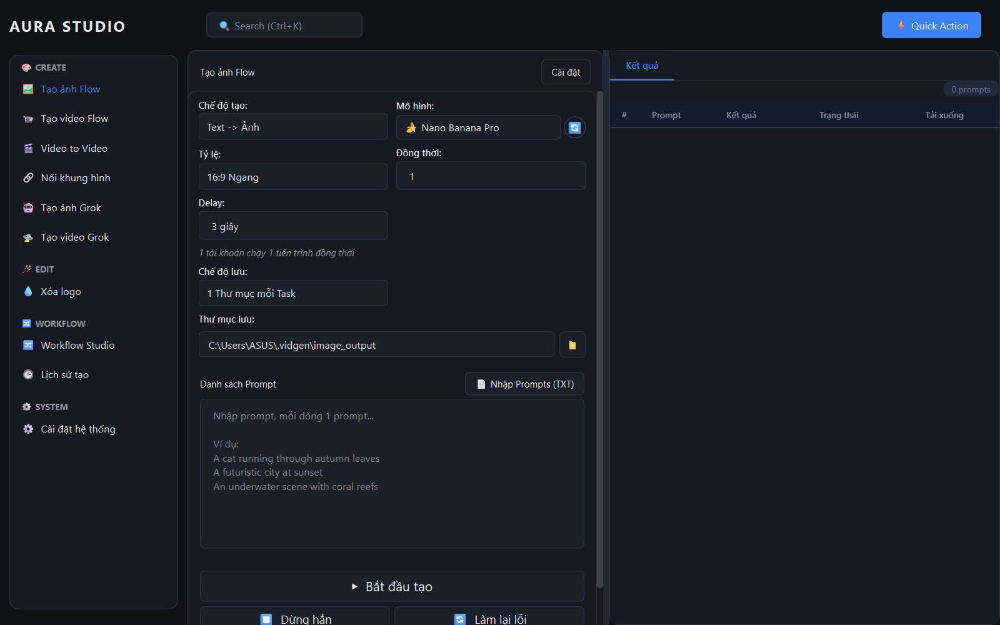
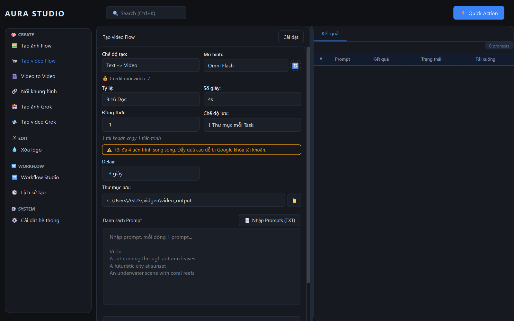
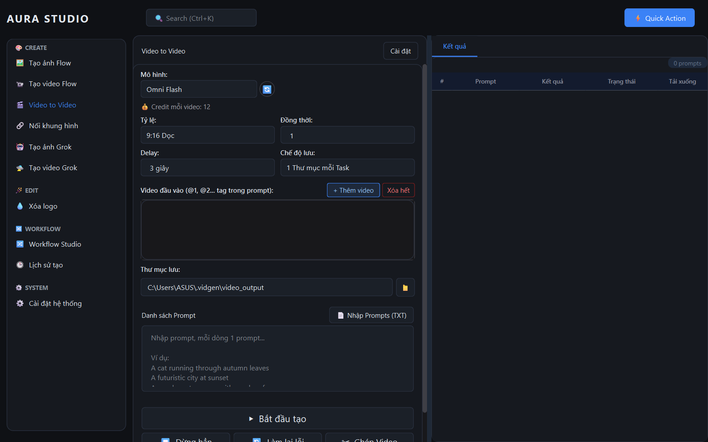
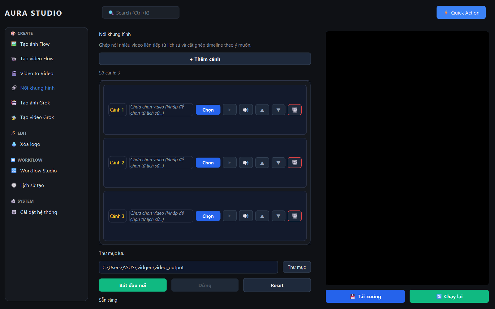
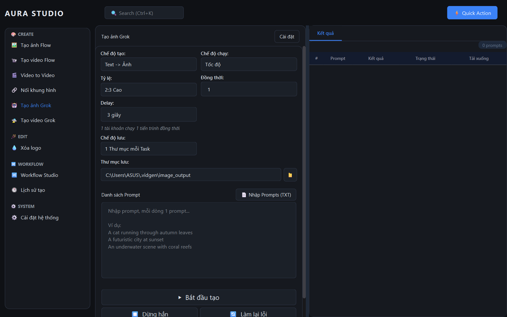
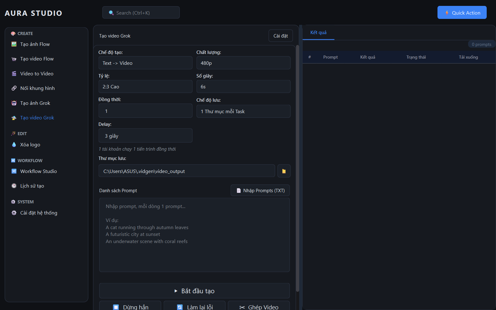
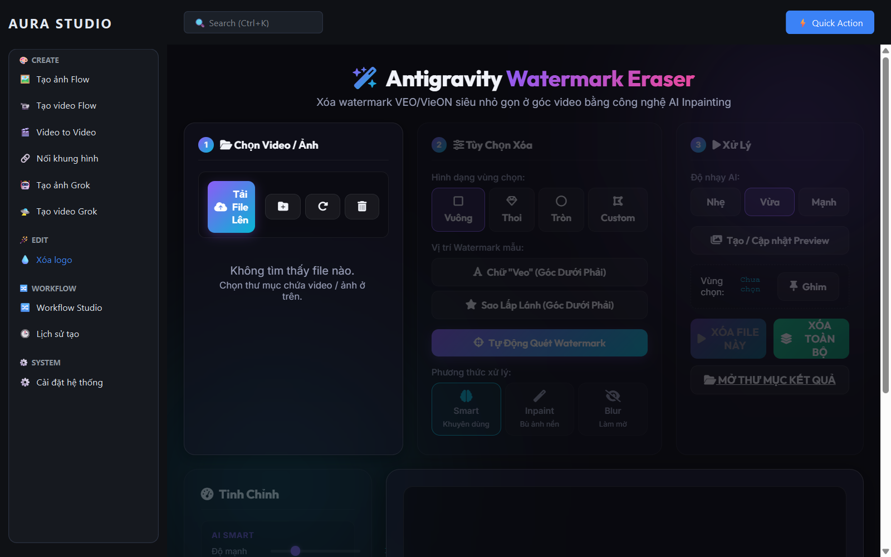
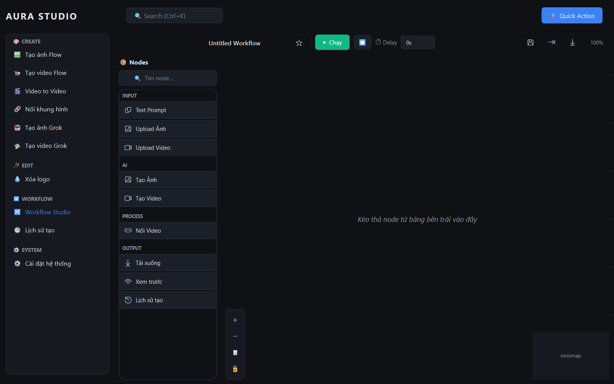
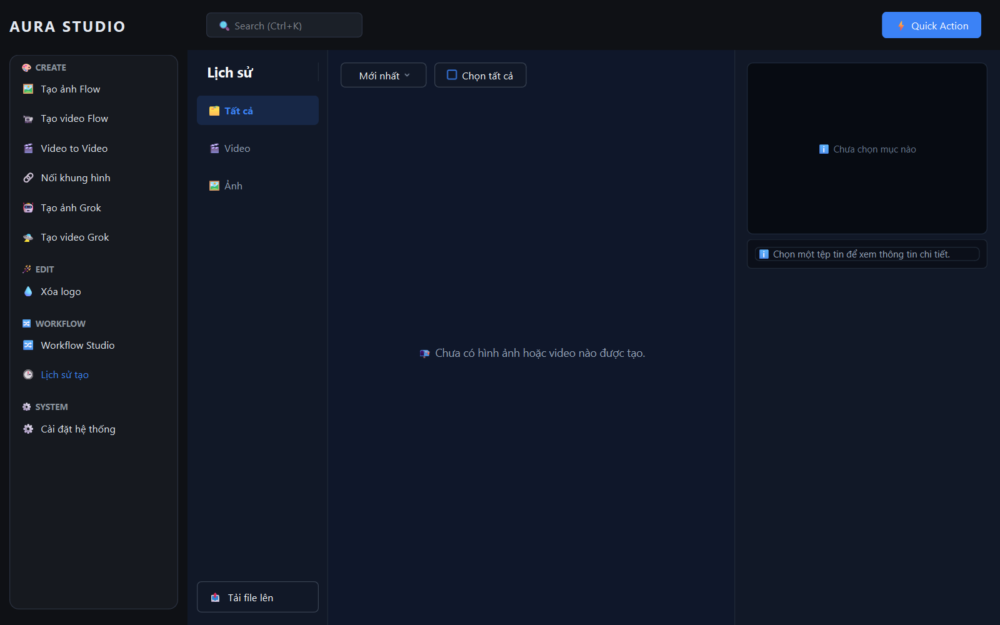
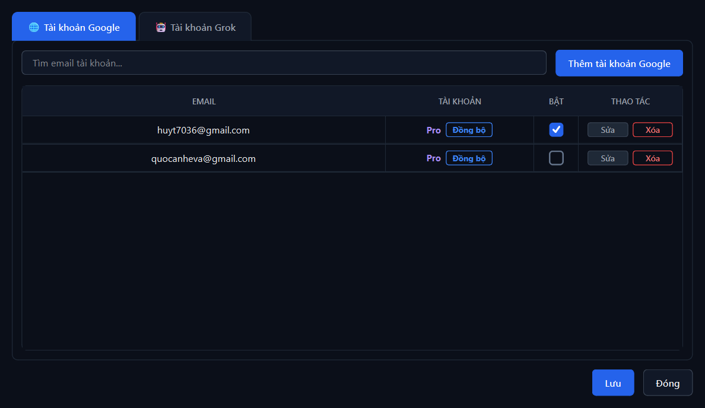

# 🎬 NAV TOOLS — Desktop AI Video/Image Generator

<p align="center">
  
</p>

**NAV Tools** là một ứng dụng desktop toàn diện và chuyên nghiệp giúp tự động hóa quy trình tạo video và hình ảnh bằng trí tuệ nhân tạo (AI) sử dụng các nền tảng tiên tiến hàng đầu hiện nay như **Google Labs (Flow - Video-FX, Image-FX)** và **Grok AI**. Ứng dụng được xây dựng trên nền tảng Python, giao diện đồ họa hiện đại với **PySide6** và lõi tự động hóa trình duyệt **Playwright** kết hợp công nghệ ẩn danh CDP chống phát hiện bot.

---

## 📸 Hướng dẫn sử dụng chi tiết từng tính năng giao diện

### 1. Tạo Ảnh Flow (Google Image-FX)
* **Chi tiết tính năng**: Tự động hóa quy trình tạo ảnh nghệ thuật sử dụng model thế hệ mới nhất của Google (**Nano Banana 2 / Nano Banana Pro**). Giao diện được chia thành hai phần trực quan:
  * **Cấu hình (Bên trái)**:
    * **Chế độ tạo**: Cho phép chọn *Text -> Ảnh* hoặc *Ảnh -> Ảnh* (khi chọn Ảnh -> Ảnh, giao diện sẽ mở rộng ô tải ảnh mẫu đầu vào).
    * **Mô hình**: Lựa chọn model (ví dụ: *Nano Banana 2*, *Omni Flash*). Bên cạnh có nút 🔄 để tự động đồng bộ hóa danh sách mô hình trực tiếp từ tài khoản Google Labs của bạn.
    * **Tỷ lệ**: Chọn các tỷ lệ khung hình ảnh mong muốn (*1:1*, *16:9*, *9:16*, *4:3*, *3:4*).
    * **Đồng thời**: Thiết lập số luồng chạy song song trên cùng một tài khoản (hỗ trợ tối đa 4 luồng để tối ưu hiệu năng).
    * **Delay**: Thời gian chờ giữa các lần gửi yêu cầu (mặc định 3 giây) nhằm đảm bảo tài khoản hoạt động tự nhiên, không bị hệ thống Google nghi ngờ.
    * **Chế độ lưu**: Tùy chỉnh chế độ lưu ảnh và đặt tên tệp tin đầu ra.
    * **Ảnh đầu vào**: Vùng bôi đen/tải ảnh mẫu đối với chế độ hình ảnh kế thừa.
  * **Trình quản lý tác vụ (Bên phải)**:
    * Chứa bảng thống kê các prompt đã thiết lập, danh sách luồng chạy thực tế, thanh tiến trình (progress bar), trạng thái tác vụ (*PENDING, RUNNING, COMPLETED, ERROR*) và nút bắt đầu/tạm dừng chạy tác vụ.
* **Giao diện**:


---

### 2. Tạo Video Flow (Google Video-FX)
* **Chi tiết tính năng**: Tự động hóa quy trình tạo video độ nét cao từ văn bản hoặc hình ảnh sử dụng model cao cấp nhất (**Omni Flash**, **Veo 3.1 - Lite**, **Veo 3.1 - Fast**, **Veo 3.1 - Quality**).
  * **Cấu hình (Bên trái)**:
    * **Chế độ tạo**: Chọn giữa *Text -> Video* (từ mô tả văn bản), *Ảnh -> Video* (tải ảnh tĩnh làm điểm bắt đầu cho video), hoặc *Frame đầu -> Frame cuối* (tải 2 ảnh để sinh đoạn video chuyển động mượt mà từ ảnh đầu đến ảnh cuối).
    * **Mô hình**: Đồng bộ danh sách model Video-FX có sẵn. Giao diện hiển thị chi tiết số lượng điểm credit tiêu thụ cho từng giây video của model đó.
    * **Số giây**: Chọn độ dài video cần tạo (*4 giây*, *6 giây*, *8 giây* hoặc *10 giây* tùy thuộc vào model).
    * **Tỷ lệ**: Thiết lập tỷ lệ khung hình video xuất ra.
  * **Trình quản lý tác vụ (Bên phải)**:
    * Tự động quản lý tiến trình chạy ẩn của Google Chrome, tự động phát hiện và nhấp bỏ qua tất cả các hộp thoại chào mừng (welcome dialog) của Google Flow, gửi request tạo video và tải tệp tin `.mp4` hoàn chỉnh về máy.
* **Giao diện**:


---

### 3. Video to Video (Character Video)
* **Chi tiết tính năng**: Tính năng nâng cao cho phép chuyển đổi phong cách nghệ thuật của một video gốc.
  * **Cấu hình (Bên trái)**:
    * Cho phép tải lên một hoặc nhiều video gốc làm video tham chiếu. Các video này sẽ được gán các thẻ `@1`, `@2`,... để bạn dễ dàng tham chiếu trực tiếp trong nội dung prompt mô tả.
    * Lựa chọn mô hình chuyển đổi và tỷ lệ khung hình tương ứng.
  * **Quy trình hoạt động**: Trình duyệt ẩn tự động upload video nguồn lên dịch vụ đám mây của Google Labs, áp dụng prompt mô tả phong cách mới và tải video đã chuyển đổi về máy tính của bạn.
* **Giao diện**:


---

### 4. Nối Khung Hình (Long Video)
* **Chi tiết tính năng**: Trình biên tập và ghép nối video chuyên nghiệp tích hợp sẵn trong ứng dụng.
  * **Trình xem video trực quan (Bên trái)**: Hỗ trợ phát video đầu vào trực tiếp với đầy đủ cụm phím điều khiển (Play, Pause, âm lượng).
  * **Thanh trượt hai đầu (Range Slider)**: Cho phép kéo thả trực quan để chọn điểm bắt đầu và kết thúc của video nguồn cần cắt/trích xuất khung hình.
  * **Ghép nối video (Video Concat)**: Tự động ghép nối các tệp tin video ngắn (6 giây - 8 giây) đã tạo từ Google Labs thành một tệp tin video dài duy nhất mà không làm giảm chất lượng hình ảnh, hỗ trợ xuất định dạng nhanh chóng thông qua thư viện FFmpeg đi kèm.
* **Giao diện**:


---

### 5. Tạo Ảnh Grok (Grok Image)
* **Chi tiết tính năng**: Tích hợp với dịch vụ X Premium để tạo ảnh bằng mô hình **Grok AI**.
  * **Giao diện điều khiển (Bên trái)**:
    * **Chế độ chạy**: Chọn giữa *Tốc độ (Speed)* để tạo nhanh hoặc *Chất lượng (Quality)* để tối ưu hóa chi tiết hình ảnh.
    * **Tỷ lệ**: Đầy đủ các tùy chọn kích thước ảnh đa dạng (*2:3 Dọc Cao*, *3:2 Ngang Rộng*, *1:1 Vuông*, *9:16 Điện thoại*, *16:9 Màn hình rộng*).
    * Hỗ trợ tải ảnh tham chiếu để tạo ảnh kế thừa (Ảnh -> Ảnh) và cấu hình số lượng ảnh tạo đồng thời.
* **Giao diện**:


---

### 6. Tạo Video Grok (Grok Video)
* **Chi tiết tính năng**: Tự động hóa tạo video ngắn động bằng mô hình Grok AI.
  * **Cấu hình**:
    * Hỗ trợ tạo video từ văn bản (*Text -> Video*) hoặc từ ảnh gốc (*Ảnh -> Video*).
    * **Độ phân giải**: Lựa chọn chất lượng video (*480p* hoặc *720p*).
    * **Độ dài**: Chọn thời lượng video (*6 giây* hoặc *10 giây*).
    * Cấu hình số tác vụ chạy song song và chế độ tự động hóa tải video từ X.com về máy.
* **Giao diện**:


---

### 7. Xóa Logo (Watermark Remove)
* **Chi tiết tính năng**: Tích hợp ứng dụng web xóa vật thể/logo thông minh chạy trực tiếp trên cửa sổ WebEngine của phần mềm.
  * **Giao diện vẽ thông minh (Masking Canvas)**: Người dùng tải ảnh hoặc video lên, sử dụng chuột làm cọ vẽ để bôi đen (tạo mặt nạ mask) trực tiếp lên vùng chứa logo/watermark cần xóa.
  * **Các mô hình xóa (Inpainting Engines)**:
    * **LaMa**: Mô hình học sâu AI tái tạo bề mặt cực kỳ chân thực đối với các chi tiết phức tạp.
    * **Telea**: Thuật toán xử lý nhanh cho các logo đơn giản.
    * **Smart Engine**: Tự động nhận diện và xóa mờ tối ưu.
  * Cho phép tải xuống từng file kết quả hoặc nén tất cả các file đã xử lý thành một file ZIP duy nhất.
* **Giao diện**:


---

### 8. Workflow Studio (Node-based Studio)
* **Chi tiết tính năng**: Không gian thiết kế quy trình kéo thả dạng khối (Node) chuyên nghiệp để tự động hóa hoàn toàn chuỗi tác vụ AI.
  * **Node Palette (Bên trái)**: Chứa danh sách các khối chức năng có thể kéo thả vào màn hình:
    * *Khối nhập liệu (Input)*: Cung cấp prompt văn bản hoặc hình ảnh.
    * *Khối AI Translation*: Dùng Gemini để tự động dịch và tối ưu hóa prompt từ tiếng Việt sang tiếng Anh trước khi gửi cho Flow.
    * *Khối Flow Image / Flow Video*: Khối thực hiện tạo ảnh/video.
    * *Khối Voice/TTS*: Tạo giọng đọc thuyết minh tiếng Việt từ văn bản.
    * *Khối Watermark*: Tự động xóa logo.
  * **Canvas trung tâm**: Nơi liên kết đầu ra của Node này với đầu vào của Node kia bằng các đường dây nối trực quan (Wires).
  * **Minimap & Viewport**: Bản đồ thu nhỏ ở góc và bộ nút zoom hỗ trợ việc di chuyển và quản lý sơ đồ workflow lớn một cách dễ dàng.
* **Giao diện**:


---

### 9. Lịch Sử Tạo (History)
* **Chi tiết tính năng**: Giao diện trực quan hiển thị và quản lý tất cả kết quả lịch sử tạo ảnh/video trên máy tính của bạn.
  * **Bảng danh sách lịch sử**: Hiển thị chi tiết thời gian tạo, tên tác vụ, mô hình sử dụng, tài khoản thực hiện và prompt.
  * **Xem trước đa phương tiện (Media Preview)**: Click vào bất kỳ tác vụ nào để hiển thị ảnh lớn hoặc phát video ngay trên bảng điều khiển bên phải. Hỗ trợ nút mở thư mục lưu trữ thực tế trên Windows Explorer để quản lý file nhanh chóng.
* **Giao diện**:


---

### 10. Cài Đặt Hệ Thống (System Settings)
* **Chi tiết tính năng**: Hộp thoại cấu hình trung tâm của phần mềm:
  * **Tab Tài khoản Google**: Danh sách các tài khoản Google đã cấu hình. Nhấn *Thêm tài khoản* để mở trình duyệt đăng nhập thực tế và đồng bộ cookie tự động. Có cột hiển thị trạng thái hoạt động (*Đã kết nối* hoặc *Lỗi/Hết phiên*).
  * **Tab Tài khoản Grok**: Quản lý danh sách tài khoản X (Grok AI) tương tự Google.
  * **Tab Cấu hình chung**: Tùy chỉnh phông chữ giao diện, đường dẫn lưu ảnh/video mặc định trên máy tính, cài đặt API Key cho dịch vụ dịch thuật Gemini, số ngày lưu giữ nhật ký log hệ thống.
* **Giao diện**:


---

## 🛠️ Yêu cầu hệ thống

* **Hệ điều hành**: Windows 10 / 11 (64-bit).
* **Python**: Phiên bản 3.10 hoặc 3.11.
* **Trình duyệt**: Google Chrome bản chính thức đã được cài đặt trên máy.

---

## 🚀 Hướng dẫn Cài đặt & Khởi chạy nhanh (Dành cho bản ZIP tải từ GitHub)

### Bước 1: Tải mã nguồn về máy
Tải file ZIP trực tiếp từ GitHub bằng nút **Code** -> **Download ZIP** và giải nén thư mục ra máy tính của bạn.

### Bước 2: Tự động khởi chạy và thiết lập môi trường
Bạn không cần phải chạy bất kỳ dòng lệnh cài đặt thư viện nào! 
* Nhấp đúp trực tiếp vào file **`NAVTools_Launcher.vbs`** (Khuyên dùng) hoặc chạy file **`Start_NAVTools.bat`**.
* **Ở lần chạy đầu tiên**: Chương trình sẽ tự động hiển thị màn hình console và tự động cài đặt môi trường ảo `.venv`, tải và cấu hình tất cả các thư viện cần thiết từ `requirements.txt`, đăng ký driver `playwright chromium` tự động.
* **Từ lần chạy thứ hai**: Chương trình sẽ chạy ẩn hoàn toàn tiến trình thiết lập và khởi động trực tiếp giao diện ứng dụng lên cực kỳ mượt mà.

*Lưu ý: Nếu máy tính của bạn chưa có Python, màn hình thiết lập lần đầu sẽ hiện thông báo cảnh báo và cung cấp link trực tiếp để bạn tải bộ cài đặt Python 3.11 chính thức của Windows.*

### Bước 3: Cấu hình FFmpeg (Bắt buộc cho xử lý Video)
Để sử dụng các tính năng ghép nối video hoặc chỉnh sửa video nâng cao ở tab **Nối khung hình**:
1. Tạo một thư mục tên `ffmpeg` trong thư mục dự án của bạn.
2. Tải tệp tin `ffmpeg.exe` cho Windows (từ trang chủ FFmpeg hoặc link tiện lợi: https://github.com/GyanD/codexffmpeg/releases).
3. Copy tệp tin `ffmpeg.exe` vừa tải vào thư mục `ffmpeg/` vừa tạo.

---

## 📦 Đóng gói phần mềm thành tệp tin chạy trực tiếp (.EXE)

Nếu muốn đóng gói toàn bộ mã nguồn thành một tệp tin duy nhất `dist/NAVTools.exe` để chạy trực tiếp không cần cài đặt Python, bạn chỉ cần mở cmd trong thư mục dự án và chạy:
```bash
pyinstaller NAVTools.spec
```
Tệp tin chạy được sau khi đóng gói sẽ nằm trong thư mục `dist/`.
